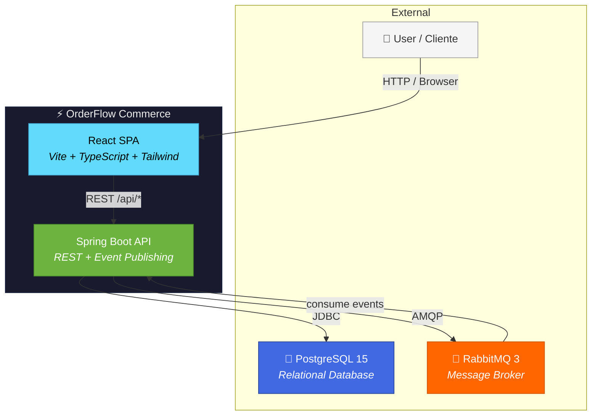
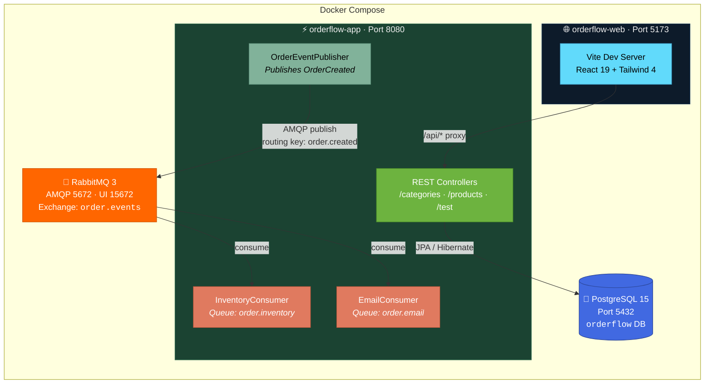
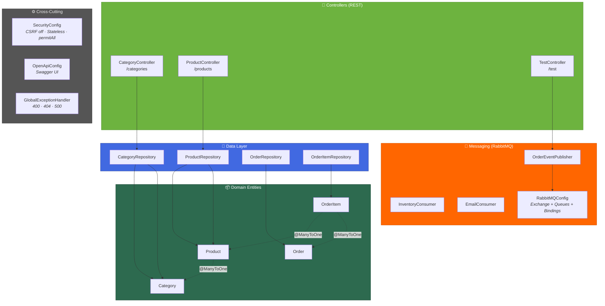
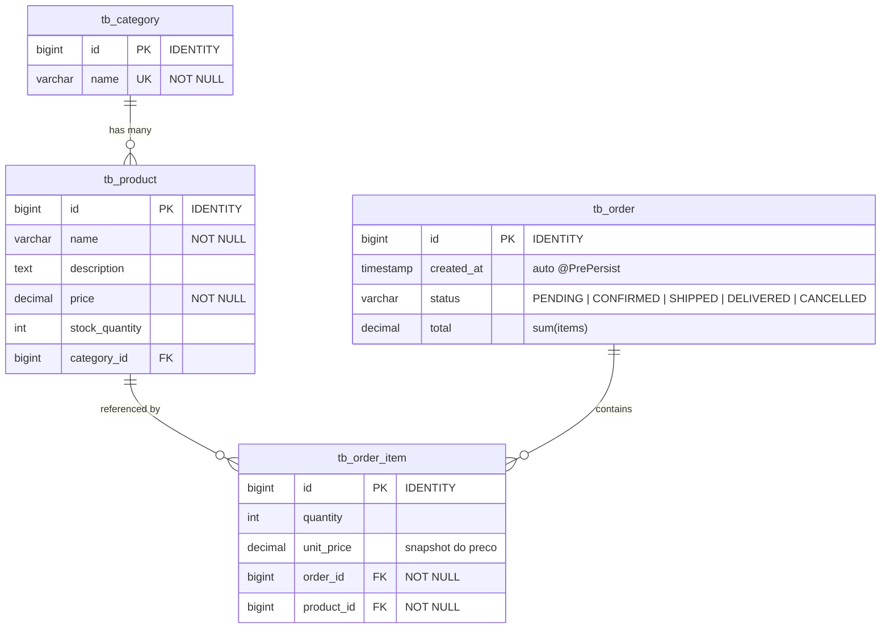
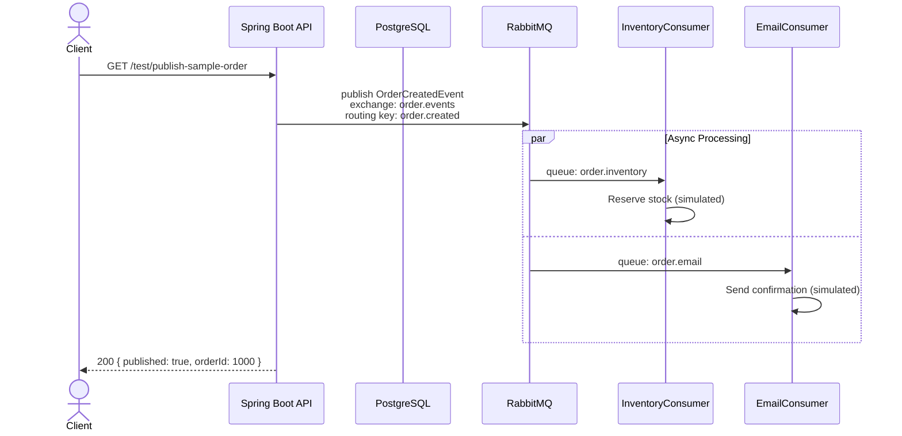

# OrderFlow Commerce

<p align="center">
  
</p>

<p align="center">
  
  
  
  
  
  
  
</p>

<p align="center">
  <b>Event-driven e-commerce platform</b> — plataforma de e-commerce orientada a eventos<br/>
  <i>Built with Java 21, Spring Boot, RabbitMQ, and React</i>
</p>

---

## What is OrderFlow? · O que é o OrderFlow?

OrderFlow Commerce is an **event-driven e-commerce REST API** that processes orders asynchronously.
When a customer checks out, an `OrderCreated` event is published to RabbitMQ — inventory reservation and email notifications happen **in the background**, without blocking the client.

O OrderFlow demonstra uma arquitetura **moderna e escalável**: mensageria assíncrona, API RESTful documentada com Swagger, e um monorepo com frontend React + backend Spring Boot, tudo orquestrado via Docker Compose com **hot reload** para desenvolvimento.

---

## Architecture · Arquitetura

> Diagramas seguem o [**C4 Model**](https://c4model.com/) — do contexto geral até o código.

### C1 — System Context · Contexto do Sistema

*Who interacts with the system? What are the external dependencies?*



### C2 — Containers · Contêineres

*What applications/services run? How do they communicate?*



### C3 — Components · Componentes da API

*Internal modules of the Spring Boot application.*



### C4 — Entity Relationship · Modelo de Dados



---

## Event Flow · Fluxo de Eventos



---

## REST API Endpoints

| Method | Endpoint | Description | Request Body |
|--------|----------|-------------|--------------|
| `GET` | `/categories` | List all categories | — |
| `GET` | `/categories/{id}` | Get category by ID | — |
| `POST` | `/categories` | Create category | `{ "name": "..." }` |
| `PUT` | `/categories/{id}` | Update category | `{ "name": "..." }` |
| `DELETE` | `/categories/{id}` | Delete category | — |
| `GET` | `/products` | List all products | — |
| `GET` | `/products/{id}` | Get product by ID | — |
| `POST` | `/products` | Create product | `{ "name", "description", "price", "stockQuantity", "category": {"id": n} }` |
| `PUT` | `/products/{id}` | Update product | same as create |
| `DELETE` | `/products/{id}` | Delete product | — |
| `GET` | `/test/ping` | Health check | — |
| `GET` | `/test/publish-sample-order` | Publish test event to RabbitMQ | — |

> 📖 **Interactive docs:** [Swagger UI](http://localhost:8080/swagger-ui/index.html) (after starting the API)

---

## Tech Stack

| Layer | Technology | Purpose |
|-------|-----------|---------|
| **Language** | Java 21 | Backend runtime |
| **Framework** | Spring Boot 3.2 | REST API, DI, auto-config |
| **Database** | PostgreSQL 15 | Persistent storage |
| **ORM** | Spring Data JPA / Hibernate 6 | Object-relational mapping |
| **Messaging** | RabbitMQ 3 | Async event processing (AMQP) |
| **Security** | Spring Security | Auth framework (currently `permitAll`) |
| **API Docs** | SpringDoc OpenAPI 2.5 | Swagger UI generation |
| **Frontend** | React 19 + TypeScript | Single Page Application |
| **Styling** | Tailwind CSS 4 | Utility-first CSS |
| **Build (FE)** | Vite 8 | Dev server + bundler with HMR |
| **Build (BE)** | Maven (wrapper) | Dependency management + build |
| **DevOps** | Docker Compose | Local orchestration |
| **Testing** | JUnit 5 | Unit tests |
| **Dev Tools** | spring-boot-devtools + inotifywait | Hot reload in Docker |

---

## Quick Start · Como Rodar

### Prerequisites · Pré-requisitos

- **Docker Engine 24+** & **Docker Compose**
- **Git**

### Option 1: Docker Compose (recommended · recomendado)

```bash
git clone https://github.com/dbfcode/commerce-async-platform.git
cd commerce-async-platform

docker compose up --build
```

| Service | URL | Credentials |
|---------|-----|-------------|
| **API** | http://localhost:8080 | — |
| **Swagger UI** | http://localhost:8080/swagger-ui/index.html | — |
| **Web (Vite)** | http://localhost:5173 | — |
| **RabbitMQ UI** | http://localhost:15672 | `orderflow` / `orderflow123` |
| **PostgreSQL** | `localhost:5432` | `orderflow` / `orderflow123` / db: `orderflow` |
| **Debug (JDWP)** | `localhost:5005` | — |

> ♻️ **Hot reload** is enabled for both API (auto-recompile + DevTools restart) and Web (Vite HMR).

### Option 2: Local Development · Desenvolvimento Local

Start only infrastructure via Docker, run API and Web natively:

```bash
# Infrastructure
docker compose up -d postgres rabbitmq

# API (terminal 1)
cd api && ./mvnw spring-boot:run -Dspring-boot.run.profiles=local

# Web (terminal 2)
cd web && npm install && npm run dev
```

### Stopping · Parando

```bash
docker compose down
```

---

## Project Structure · Estrutura do Projeto

```
commerce-async-platform/
├── docker-compose.yml          # Orchestrates all services
├── AGENTS.md                   # Dev environment instructions
│
├── api/                        # ⚡ Spring Boot Backend
│   ├── Dockerfile              # Dev image (JDK + Maven + inotify)
│   ├── dev-entrypoint.sh       # File watcher for hot reload
│   ├── pom.xml                 # Maven dependencies
│   └── src/
│       ├── main/java/com/orderflow/ecommerce/
│       │   ├── Application.java
│       │   ├── config/         # Security, OpenAPI, RabbitMQ
│       │   ├── controllers/    # REST endpoints
│       │   ├── dtos/           # Data transfer objects
│       │   ├── entities/       # JPA entities + enums
│       │   ├── exceptions/     # Global error handler
│       │   ├── messaging/      # Publisher, consumers, events
│       │   └── repositories/   # Spring Data JPA interfaces
│       └── main/resources/
│           ├── application.properties
│           ├── application-docker.properties
│           └── application-local.properties
│
└── web/                        # 🌐 React Frontend
    ├── Dockerfile              # Production build (nginx)
    ├── Dockerfile.dev          # Development (Vite HMR)
    ├── package.json
    ├── vite.config.ts          # Proxy /api → backend
    └── src/
        ├── App.tsx             # Main component
        ├── lib/api.ts          # API client
        └── index.css           # Tailwind imports
```

---

## RabbitMQ Topology · Topologia de Mensageria

| Resource | Name | Type | Notes |
|----------|------|------|-------|
| **Exchange** | `order.events` | Topic (durable) | Central event hub |
| **Queue** | `order.inventory` | Durable | Inventory reservation |
| **Queue** | `order.email` | Durable | Email notifications |
| **Routing Key** | `order.created` | — | Binds both queues |

Both queues receive the same `OrderCreatedEvent` (fan-out via shared routing key), enabling **independent, parallel processing**.

---

## Roadmap · Evolução Planejada

> Detalhes em [`api/docs/microservices-migration.md`](api/docs/microservices-migration.md)

| Phase | Description | Status |
|-------|-------------|--------|
| 1 | **Baseline** — Monolith with event-driven order processing | ✅ Done |
| 2 | **Contracts** — Shared event schemas (`orderflow-contracts`) | 🔜 Planned |
| 3 | **Extract Workers** — Inventory & notification as separate services | 🔜 Planned |
| 4 | **Extract APIs** — Catalog & orders as independent microservices | 🔜 Planned |
| 5 | **Hardening** — DLQ, idempotency, observability, CI pipeline | 🔜 Planned |

**Planned integrations:** Redis caching (cart), JWT authentication, Resilience4j circuit breakers.

---

## Tests · Testes

```bash
# Backend unit tests
cd api && ./mvnw test

# Frontend lint
cd web && npm run lint

# Frontend build check
cd web && npm run build
```

---

## Contribution Workflow · Como contribuir

Para manter o monorepo organizado e o histórico do Git limpo, adotamos padrões estritos para a nomenclatura de **branches** e **mensagens de commit** (baseado em Conventional Commits).

---

### Branch Naming · Padrão de Branches

Toda nova alteração deve partir da branch principal utilizando a seguinte estrutura em **inglês** e com letras **minúsculas**:

#### Formato
```
padrão: [tipo-abreviado]/[escopo-opcional]-[breve-descrição]
```

#### Tipos Permitidos (Prefixos)
* `feat/` : Nova funcionalidade (ex: `feat/cart-page`)
* `fix/` : Correção de bug (ex: `fix/rabbitmq-retry`)
* `docs/` : Alterações exclusivas de documentação (ex: `docs/separate-swagger-docs`)
* `refactor/` : Refatoração de código que não altera o comportamento (ex: `refactor/clean-controllers`)
* `chore/` : Atualizações de build, dependências ou ferramentas (ex: `chore/update-docker-compose`)

---

### Semantic Commits · Commits Semânticos

As mensagens de commit devem ser escritas obrigatoriamente em **inglês**, utilizando letras **minúsculas** e o verbo no **imperativo** (ex: *add*, *fix*, *remove*, em vez de *added*, *fixed*, *removing*).

#### Formato
```
padrão: [tipo-abreviado](escopo): <descrição-curta>
```

#### Tabela de Tipos e Escopos

| Tipo | Uso | Escopo | Significado |
|:-----|:----| :--- | :--- |
| **feat**     | Nova funcionalidade | **auth** | Autenticação, JWT |
| **fix**      | Correção de bug | **produto** | CRUD de produtos |
| **docs**     | Documentação | **categoria** | CRUD de categorias |
| **style**    | Formatação, espaços, lint (não altera código) | **usuario** | CRUD de usuários |
| **refactor** | Refatoração de código | **carrinho** | Carrinho de compras |
| **test**     | Adicionar ou corrigir testes | **pedido** | Checkout e pedidos |
| **chore**    | Configuração, dependências, build | **messaging** | Fila, RabbitMQ, consumidores |
| **chore**    | Configuração, dependências, build | **docker** | Dockerfile, docker-compose |
| **chore**    | Configuração, dependências, build | **infra** | Configurações gerais |

#### Exemplos Práticos · Examples

* **Funcionalidades e Correções:**
    * `feat(auth): implement login with JWT`
    * `feat(messaging): configure RabbitMQ and publish order event`
    * `fix(carrinho): avoid duplicate items in cart`
    * `fix(auth): fix expired token validation`

* **Refatoração, Testes e Outros:**
    * `refactor(produto): extract validation logic to service`
    * `test(pedido): add integration tests with testcontainers`
    * `docs: add architecture diagram to README`
    * `chore: configure docker-compose with PostgreSQL and RabbitMQ`

#### Regras de Ouro
1. **Inglês sempre!**
2. **Minúsculo** – Tudo em letras minúsculas.
3. **Imperativo** – "add" e não "added" ou "adding".
4. **Curto** – Até 50 caracteres na mensagem principal.
5. **Sem ponto final** – Não termine a linha de resumo com ponto `.`.

## Contributors · Colaboradores

| Name | Role | Contributions |
|------|------|---------------|
| **Diego Ferreira** | Coordinator and Developer | RabbitMQ, checkout, Docker, architecture, Java, Spring boot, React, Redis |
| **Pablo Santos** | Developer | React, Front-end, TypeScript & JavaScript |
| **Max Zimmerman** | Developer | Java, Spring Boot, CRUDs, JWT auth, cart, Swagger, Docs |
| **Giovanna Caxias** | Junior Developer | CRUD, JWT auth, cart, Swagger |

---

## License · Licença

Portfolio project. Not licensed for commercial use.
Projeto de portfólio. Não licenciado para uso comercial.
